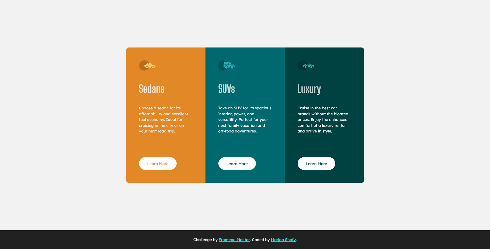

# Frontend Mentor - 3-column preview card component solution

This is a solution to the [3-column preview card component challenge on Frontend Mentor](https://www.frontendmentor.io/challenges/3column-preview-card-component-pH92eAR2-). Frontend Mentor challenges help you improve your coding skills by building realistic projects. 

## Table of contents

- [Overview](#overview)
  - [The challenge](#the-challenge)
  - [Screenshot](#screenshot)
  - [Links](#links)
- [My process](#my-process)
  - [Built with](#built-with)
- [Author](#author)

## Overview

### The challenge

Users should be able to:

- View the optimal layout depending on their device's screen size
- See hover states for interactive elements

### Screenshot

- Live Site URL: [Visit Site on Netlify](https://determined-volhard-4d1e0b.netlify.app/)

## My process

### Built with

- Semantic HTML5 markup
- CSS custom properties
- Flexbox
- Mobile-Friendly design

## Author

- Website - [Marjan Shofy](https://www.codermj.com)
- YouTube - [codermj](https://www.youtube.com/c/codermj)
- Frontend Mentor - [@mjshofy](https://www.frontendmentor.io/profile/mjshofy)
- Twitter - [@mjshofy](https://twitter.com/mjshofy)
- Github - [@mjshofy](https://github.com/mjshofy)
